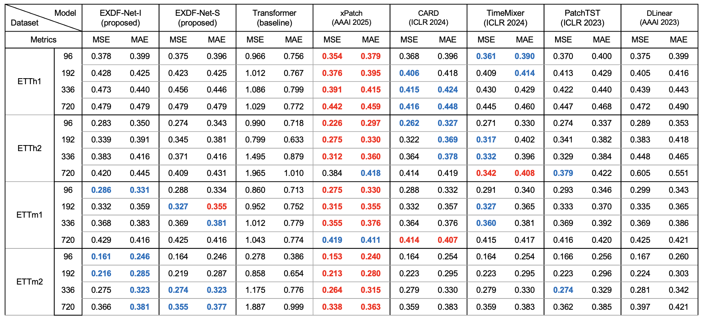

# EXDF-Net
Embedding-token and eXponential Dual Flow Net(EXDF-Net) for Time series forecasting

Model Architecture

Long-term Forecasting with Unified Experimental Settings (Multivariate)

Fixed Look-back window size (L=96)

Sample prediction graph of the lookback window L = 192

Traffic

Electricity

ETTh2

ETTm2

Reference

- T. Kim, et al., “Reversible instance normalization for accurate time-series forecasting against distribution shift,” in Proc. Int. Conf. Learn. Representations, 2022.
- J. Xu et al., “Autoformer: Decomposition transformers with autocorrelation for long-term series forecasting,” in Proc. Adv. Neural Inf. Process. Syst., 2021, pp. 1–12.
- A. Stitsyuk, J. Choi, “xPatch: Dual-Stream Time Series Forecasting with Exponential Seasonal-Trend Decomposition,” arXiv:2412.17323, 2024.
- R. Ni, Z. Lin, S. Wang, and G. Fanti, “Mixture-of-linear-experts for long-term time series forecasting,” in AISTATS, May 2024.
- X. Wang, T. Zhou, Q. Wen, J. Gao, B. Ding, and R. Jin, ‘‘CARD: Channel aligned robust blend transformer for time series forecasting,’’ in Proc. 12th Int. Conf. Learn. Represent., 2024
